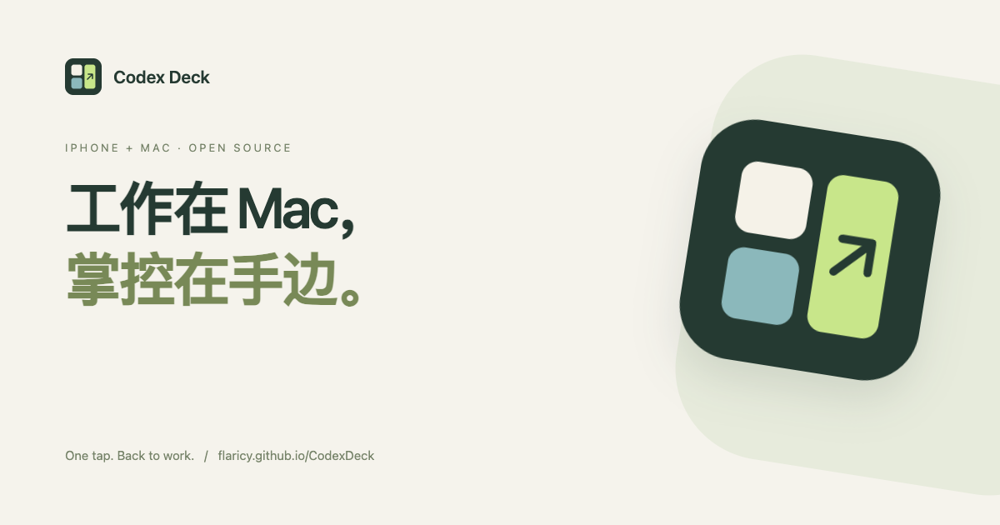

<h1 align="center">Codex Deck</h1>

工作在 Mac，掌控在手边。

<a href="https://flaricy.github.io/CodexDeck/">宣传页</a> · <a href="README.md">English</a> · <a href="INSTALL.md">安装指南</a> · <a href="https://github.com/flaricy/CodexDeck/releases">下载</a>

把 iPhone 放在键盘旁，作为 Codex 的会话状态盘和快捷键。抬眼看状态，轻点回到 Mac 对应任务。

## 能做什么

- 最多三个大按键：一个占满、两个或三个平分，横竖屏自动适配。
- 名称跟随 Codex 桌面侧栏，包括手动改名。
- 蓝色运行中，绿色完成或 STOP。不会因为长时间无输出而猜测停止。
- 闲置会话点“不看”，设置里可以恢复；隐藏选择会保留。
- 展示真实 Codex 剩余额度和重置时间，不拿其他额度桶补缺失值。
- 默认保持 iPhone 前台常亮；右下角太阳可切换，有震动和文字反馈，不影响 Mac 睡眠。断线保留键盘并自动重连，期间禁用跳转。
- Mac 菜单栏程序独立运行，支持二维码配对、暂停连接和可选的登录启动。
- 局域网 HTTPS、配对令牌与证书指纹校验，不经过中转服务器。

## 安装

详见 [安装与使用](INSTALL.md)。iPhone 需要 iOS 17+ 和 Xcode 签名安装；Mac 需要 macOS 14+、Python 3.10+ 和已登录的 Codex 桌面版。

目前没有 App Store/TestFlight 版本。Mac 下载版面向 Apple Silicon，尚未经过 Apple 公证。仓库不包含个人签名、配对密钥或真实会话截图。

## 当前范围

只读取本机 Codex 桌面/扩展来源的主会话记录，不包括 SSH 远程主机和子代理。记录不是进程存活证明：Mac 异常退出可能留下最后的运行状态。

**待回答和审批事件尚不能可靠识别，因此本版不能当作提问提醒器使用。** 不能把“没有橙色”理解成“没有输入在等待”。这些限制也写在 App 的状态说明中。项目不尝试绕过 Codex 内部接口访问控制。

点击成功表示 macOS 接受会话链接；不会发送提示词或代为回答。

## 开发

打开 `iOS/CodexDeck.xcodeproj` 构建 iPhone 版。运行 `python3 macOS/build.py` 构建 Mac 程序。测试命令、目录结构见 [英文 README](README.md)，贡献说明见 [CONTRIBUTING.md](CONTRIBUTING.md)。

MIT 开源。交互参考 [herdr](https://github.com/herdrdev/herdr)，未复制其代码；网页视觉方向参考 [SwiftNote](https://flaricy.github.io/SwiftNote/)，代码和素材独立制作。

Codex Deck 是 flaricy 的独立项目，与 OpenAI 没有隶属或背书关系。
